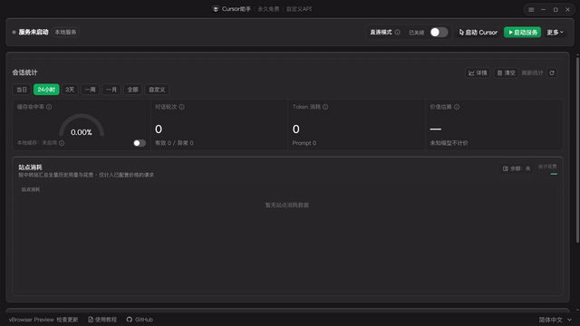

# Cursor助手

  

<h1 align="center">Cursor助手</h1>

面向 Cursor 的本地模型适配、代理网关、用量统计与 Agent 工作台。

  
  
  
  
  

  <a href="#快速开始">快速开始</a> ·
  <a href="#功能概览">功能概览</a> ·
  <a href="#视频与动态图">视频与动态图</a> ·
  <a href="#社区与反馈">社区与反馈</a>

> 把自己的模型 API 接入 Cursor，在本地完成供应商管理、协议适配、模型路由、用量统计、自动委派和问题排查。

## 为什么使用 Cursor助手

Cursor 本身负责优秀的编辑器与 Agent 体验，Cursor助手负责把模型连接与本地运行链路整理好：你可以继续使用 Cursor 的工具调用和任务工作流，同时自由选择官方 API、兼容网关或自建服务。

## 功能概览

| 图标 | 能力 | 说明 |
| :---: | --- | --- |
|  | 多供应商接入 | OpenAI 兼容接口、Anthropic 原生协议、Gemini 原生协议与常见第三方网关。 |
|  | 本地代理网关 | 在本机完成 Cursor 与模型供应商之间的请求转发和流式事件转换。 |
|  | 用量与费用统计 | 查看请求数、输入/输出 token、缓存命中率、站点消耗和估算费用。 |
|  | Agent 与 Multitask | 支持 Explorer 子代理、视觉委派、监督状态和 Cursor Task 状态同步。 |
|  | 模型目录与自动匹配 | 拉取供应商模型目录，自动匹配上下文窗口，并支持模型可用性探测。 |
|  | Debug 与诊断 | 保存脱敏后的请求链路、provider pass、工具调用和终态信息，方便定位问题。 |
|  | 本地凭据管理 | API Key 与余额查询凭据由本地配置管理；发布到云端的源码不包含用户凭据。 |

### 支持的平台

- Windows x64、Windows ARM64、Windows x32
- Linux x64
- macOS Intel、macOS Apple Silicon

发布包会由 GitHub Actions 自动构建，前往 [Releases](https://github.com/Sakana-yuyu/cursor-byok/releases) 下载对应平台版本。

## 视频与动态图

### 60 秒快速演示

<video controls muted loop playsinline poster="docs/assets/home-preview.png" width="960">
  <source src="docs/assets/cursor-assistant-demo.mp4" type="video/mp4" />
  当前环境不支持内嵌视频，请直接打开 <a href="docs/assets/cursor-assistant-demo.mp4">演示视频</a>。
</video>

### GIF 预览

视频和 GIF 展示浏览器预览模式中的真实界面状态，演示数据为本地 mock 数据，不会发送真实 API 请求，也不包含真实密钥。

## 快速开始

### 1. 下载并安装

1. 打开 [GitHub Releases](https://github.com/Sakana-yuyu/cursor-byok/releases)。
2. 下载对应平台的安装包或压缩包。
3. Windows 如果出现 SmartScreen 提示，确认文件来源后选择“更多信息”并继续运行。
4. 启动 Cursor助手，首次启动会在用户数据目录生成本地 MITM CA；私钥不会写入源码仓库。

### 2. 添加模型供应商

1. 打开“模型配置”。
2. 点击“添加供应商”或选择已有供应商模板。
3. 填写 API 地址、API Key 和模型 ID。
4. 优先点击“拉取模型”，从供应商目录选择模型。
5. 点击“测试”确认请求能够正常返回。
6. 保存配置并返回首页。

> 地址要填写供应商实际使用的协议入口。不同供应商可能分别要求 /v1、Anthropic 原生入口、Gemini /v1beta 或网关自定义路径；如果模型列表为空，先检查地址、鉴权方式和模型目录接口是否匹配。

### 3. 让 Cursor 使用本地代理

1. 在首页启动本地服务。
2. 点击“修复 Cursor 配置”，让应用写入本地代理地址。
3. 完全退出并重新打开 Cursor，使代理设置生效。
4. 在 Cursor 中发送一条普通请求，确认模型回复和工具调用均正常。

### 4. 使用 Multitask 与视觉委派

1. 在设置中打开 Multitask。
2. 为 Explorer 或视觉委派选择可用模型。
3. 在 Cursor 中使用普通探索型任务，Cursor助手会按配置创建委派任务。
4. 在“会话分析”或“实时统计”中查看运行状态、token 与缓存情况。

### 5. 查询余额与用量

- 供应商配置页：查看模型目录、测试结果和供应商余额。
- 首页统计：查看总请求量、token、缓存命中率和站点消耗。
- 请求明细：按请求查看模型、provider、耗时、终态和异常信息。
- 导出日志：导出前请先检查是否包含你自己的请求文本或供应商返回内容。

## 常见问题

### Cursor 显示 stopped，但应用里看不到结果

请保留请求时间、Cursor 版本、模型 ID、任务文本和应用目录下的 runtime/debug 日志。重点检查 request_id、conversation_id、model_call_id、tool_call_id 和 exec_id 是否能够串起完整执行链路。

### 模型列表为空或返回 401/404

依次检查：

1. API 地址是否包含正确的版本路径。
2. 当前供应商的鉴权头是否正确。
3. 该供应商是否提供 /models 或其他模型目录接口。
4. 模型 ID 是否属于当前账号或当前网关。
5. 是否把 Gemini、Anthropic 原生接口误配成 OpenAI 兼容接口。

### Windows 或 macOS 证书提示

Cursor助手会在用户数据目录生成 CA 证书，并在需要时引导宿主信任该证书。不要把用户目录中的 ca.key、API Key 或完整请求日志上传到 issue、网盘或 Git 仓库。

### 如何清空本地敏感数据

先退出 Cursor 和 Cursor助手，再删除应用用户数据目录中的配置、日志、历史与 data/ca.key。删除 CA 后下次启动会重新生成一对新的本地 CA 材料。

## 开发与验证

后端使用 Go，桌面前端位于 frontend，协议定义位于 proto。

    go test ./...
    go vet ./...
    go build ./...

    Set-Location frontend
    yarn install --frozen-lockfile
    yarn lint
    node ./scripts/run-vite-build.mjs --scan --mode production

浏览器预览模式：

    Set-Location frontend
    yarn dev:browser

发布前请额外检查：

    git status --short
    git ls-files | Select-String -Pattern '(^|/)(\.env|.*\.key|.*\.pem|logs?|dist|bin|node_modules)(/|$)'
    $sk = ((115,107,45 | ForEach-Object { [char]$_ }) -join '')
    $google = ((65,73,122,97 | ForEach-Object { [char]$_ }) -join '')
    $github = ((103,104,112,95 | ForEach-Object { [char]$_ }) -join '')
    $privateKey = ('-----' + 'BEGIN .*PRIVATE KEY' + '-----')
    $pattern = ($sk + '[A-Za-z0-9]{12,}|' + $google + '[A-Za-z0-9_-]{20,}|' + $github + '[A-Za-z0-9]{20,}|' + $privateKey)
    rg -n --hidden --glob '!frontend/node_modules/**' --glob '!frontend/dist/**' $pattern .

## 安全与隐私

- 不要提交 API Key、访问令牌、Cookie、私钥、用户数据库、完整请求日志或本地历史。
- internal/certs/ca.key 只允许存在于用户数据目录，不属于源码分发内容。
- Debug 日志可能包含请求文本、模型名称和 provider 元数据；分享前请脱敏。
- 供应商的计费、余额和数据保留策略由供应商决定，请自行确认其服务条款。
- 本项目只提供本地适配与转发能力，不托管你的 API Key，也不保证第三方供应商服务持续可用。

## 社区与反馈

-  [GitHub 仓库](https://github.com/Sakana-yuyu/cursor-byok)
-  [GitHub Releases](https://github.com/Sakana-yuyu/cursor-byok/releases)
-  [Linux.do 社区](https://linux.do/)
-  [原作者地址（作者主页）](https://space.bilibili.com/311706663/upload/video)

> 原作者地址说明：上方 Bilibili 链接是项目原作者公开的作者主页，保留该地址用于作者署名、更新动态和视频内容；项目代码、发行版和社区反馈入口由本仓库维护。

Linux.do 发布文案位于 docs/promotion/linuxdo-post.md，欢迎反馈安装体验、供应商适配和 Cursor 本地模式问题。

## 贡献

提交 Issue 或 Pull Request 时，请提供：

1. 可复现步骤。
2. 操作系统、Cursor 版本和 Cursor助手版本。
3. 使用的 provider 类型与模型 ID；不要提供 API Key。
4. 脱敏后的错误信息和必要日志片段。

请先阅读 CONTRIBUTING.md 和 CONTRIBUTING_EN.md。

## 许可证

本项目基于 [MIT License](LICENSE) 发布。

<!-- contributors-start -->
<table><tr>
<td></td>
<td></td>
<td></td>
<td></td>
<td></td>
<td></td>
<td></td>
<td></td>
<td></td>
<td></td>
<td></td>
<td></td>
<td></td>
<td></td>
<td></td>
<td></td>
</tr></table>
<!-- contributors-end -->
