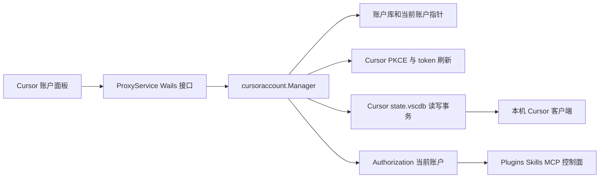

# Cursor 多账户管理与客户端切换设计

## 背景与目标

当前 `cursor-byok` 仅维护一份 `cursor-account.json`，供插件、Skills、MCP 注册表和其他 Cursor 控制面请求使用。该账号刻意与 Cursor 客户端实际登录态隔离。

本变更参考 `jlcodes99/cockpit-tools` 的 Cursor 账户链路，在 Go/Wails/Vue 技术栈中复现其与账户登录直接相关的能力：独立账户库、OAuth 登录、本机 Cursor 导入、Token/JSON 导入、账户标签、受控导出，以及切换时向 Cursor 的 `state.vscdb` 回写认证信息。

目标是让用户能在助手中保留并选择多个 Cursor 账号，并在明确执行切换操作时使 Cursor 客户端和助手控制面同时使用所选账号。

## 范围

### 纳入

- 浏览器 PKCE OAuth 登录并保存为独立账户。
- 从本机 Cursor `state.vscdb` 导入当前账号。
- 通过粘贴 Token 或受控 JSON 导入账户。
- 账户列表、当前账户标识、标签编辑、删除和去重。
- 用户主动导出账户摘要，及带明确二次确认的可恢复账户包导出。
- 将选中账号写入 Cursor 本机 `state.vscdb`，完成后重新启动 Cursor。
- 现有 Plugins、Skills、MCP 和控制面请求始终从当前账户取得授权。
- 从现有单账号凭据迁移，保留可恢复备份。

### 不纳入

- Cockpit 的跨 IDE 账户、Cursor 多实例、远端同步、自动轮换、套餐/配额刷新和告警。
- 未经用户操作自动改写 Cursor 客户端认证库。
- 上传、记录、打印或通过前端返回 access token、refresh token、Cookie 或完整认证数据库。

## 现有基础与复用

- `internal/cursoraccount.Manager` 已实现 Cursor 官方 PKCE、轮询、刷新 token、`GetMe` 邮箱补全和控制面 `Authorization`。
- `internal/cursor/state_db.go` 已维护跨平台 `state.vscdb` 路径、`cursorAuth/*` 白名单、官方认证备份和 SQLite 读写/恢复逻辑。
- `internal/client.ProxyService` 是 Wails bridge 的账户调用入口，`internal/backend.NewHost` 已接受控制面授权提供者。
- `frontend/src/components/CursorAccountCard.vue` 已有单账号状态和登录交互，可在不改变页面信息架构的前提下升级为多账号账户面板。

不复制 Cockpit 的 Rust/Tauri 模块；仅将其账户数据模型、导入和注入行为映射为本项目现有模块边界。

## 架构



`Manager` 继续是控制面授权提供者，但内部从“单份凭据”改为“账户库加当前账户指针”。Cursor 本机认证库由独立的 state-db 适配层读写，账户管理层不直接拼接 SQLite SQL。

## 数据模型与存储

根目录使用 `appdata.DataRootPath()`，新增以下文件：

```text
cursor-accounts/
  index.json
  current.json
  accounts/
    <account-id>.json
  backups/
    switch-<timestamp>-<operation-id>/
legacy/
  cursor-account.json.bak
```

### 账户索引

`index.json` 只含可安全展示的摘要：`id`、`email`、`authId`、`tags`、`createdAt`、`lastUsedAt`。索引与账户文件分别原子写入，并共享同一进程锁。若索引缺失或损坏，列表读取会扫描 `accounts/*.json` 重建摘要索引，避免账户文件仍在但 UI 空白。

### 完整账户文件

每个 `<account-id>.json` 含 access token、refresh token、`authId`、email 及能安全回写到 Cursor 的认证元数据。文件和临时文件权限设置为 `0600`；路径只能由 UUID/受限字符的账户 ID 组成，拒绝路径分隔符和 `..`。

完整账户从不经 Wails bridge 返回。前端仅接收账户摘要和非敏感操作结果。后端日志只记录操作 ID、账号 ID 的短哈希、阶段和错误类别。

### 当前账户

`current.json` 只保存当前 `accountId` 与更新时间。`Authorization(ctx)` 每次从当前账户读取凭据，需要刷新时仅原子更新该账户文件。若当前指针不存在、账户被删除或刷新接口要求登出，控制面返回现有的未登录语义，不回退到任意其他账户。

### 单账号迁移

首次启动账户库不存在时，读取旧 `cursor-account.json`：

1. 凭据存在且 access token 非空时，创建首个账户并标记为当前账户。
2. 成功写入账户文件、索引和当前指针后，将旧文件移动到 `legacy/cursor-account.json.bak`。
3. 任一步失败时不删除旧文件，也不创建半完成的当前指针。
4. 旧文件不存在或为空时建立空账户库。

迁移可重复执行，不重复导入身份相同的账户。

## 账户操作

### OAuth 登录

保留官方 `loginDeepControl` PKCE 方式：生成 verifier/challenge 和登录 UUID，打开浏览器，轮询 `api2.cursor.sh/auth/poll`。登录成功后调用 `GetMe` 尽力补全邮箱，将凭据写入新账户或按 `authId` 更新已有账户。首次 OAuth 成功的账户设为当前账户，但不会自动改写 Cursor 客户端 `state.vscdb`。

开始新 OAuth 会取消先前未完成的会话；取消、超时和网络失败只影响该登录会话，不影响已保存账户或当前 Cursor 客户端。

### 本机 Cursor 导入

读取本机平台对应的 `state.vscdb`，仅读取以下白名单键：

- `cursorAuth/accessToken`
- `cursorAuth/refreshToken`
- `cursorAuth/cachedEmail`
- `cursorAuth/authId`
- `cursorAuth/stripeMembershipType`
- `cursorAuth/stripeSubscriptionStatus`
- `cursorAuth/cachedSignUpType`

读取时以只读 SQLite 方式打开，并将 WAL/SHM 作为一致性读取环境的一部分处理。缺少 access token 时返回“未发现可导入 Cursor 登录态”，不创建空账户。导入不会改变当前账户或 Cursor 客户端。

### Token 与 JSON 导入

Token 导入接受非空 JWT 或 Cursor Bearer token，规范化后通过 token payload 和 `GetMe` 获取可用身份。JSON 导入使用显式 schema，只接受账户恢复包或上述白名单字段；未知字段、嵌套缓存、Cookie、浏览器存储和任意文件路径一律忽略。

导入去重优先级为：`authId` 相同，其次为 email 和 access token 之一一致；`authId` 已存在时合并缺失元数据和标签，不创建重复账户。

### 标签、删除与导出

标签是去空白、大小写不敏感去重的短文本列表。删除仅移除助手账户文件和索引摘要，不调用 Cursor 退出登录，也不改写 `state.vscdb`。删除当前账户前必须选择另一账户或确认仅移除助手控制面选择；后一种情况将清空当前指针，但仍不触碰 Cursor 客户端。

默认导出仅包含摘要。导出可恢复账户包必须由用户在模态框中二次确认，显示“包含登录凭据，仅可保存到受信任位置”；导出文件权限设为 `0600`。导出路径和文件内容不写日志。

## Cursor 客户端切换事务

客户端切换必须由用户显式点击指定账户的“切换到 Cursor”触发，不能由刷新、自动导入或启动恢复隐式触发。

### 前置检查

1. 校验目标账户存在、access token 非空且账户文件可读。
2. 解析当前平台的 Cursor `state.vscdb` 路径；数据库不存在时中止，不创建未经 Cursor 初始化的真实数据库。
3. 枚举 Cursor 进程；显示将关闭并重启 Cursor 的确认说明。用户确认后，按现有进程工具正常关闭目标进程并确认退出。无法退出时中止，不创建备份也不写数据库。

### 备份与注入

1. 为本次操作生成 operation ID，在 `backups/` 下创建目录。
2. 复制 `state.vscdb` 及存在的 `state.vscdb-wal`、`state.vscdb-shm`，记录每个副本的大小与 SHA-256 到仅含元数据的 manifest。
3. 使用 SQLite 写事务仅 upsert 白名单认证键。缺失的可选字段会删除对应旧认证键，防止前一个账户的刷新 token、身份或订阅字段残留。
4. 关闭数据库后重新以只读方式读取必需键，验证 access token 与账号标识匹配目标账户。
5. 仅验证成功后写 `current.json` 并更新目标账户 `lastUsedAt`。

在注入前保留现有 `cursor-auth-backup.json` 的“官方账号保护”语义，但不将其当作多账户切换回滚源；每次切换使用专属完整数据库备份，避免覆盖用户此后在 Cursor 中重新登录的官方账号。

### 启动与回滚

成功注入后按现有 Cursor 启动入口重启 Cursor。启动命令返回失败、进程立即退出或注入后读回校验失败时：

1. 关闭可能已启动的目标 Cursor。
2. 将三份数据库文件从本次专属备份恢复。
3. 恢复切换前的 `current.json`。
4. 返回包含操作阶段的错误，但不暴露 token 或路径外的敏感内容。

成功后备份默认保留最近 10 次，按时间清理更早备份；清理失败只写警告，不影响已成功切换。用户可在账户页看到最近操作的时间、结果和可恢复状态，但不能看到备份内容。

## 前端交互

现有“Cursor 控制面账号”卡片升级为账户管理面板：

- 顶部显示当前账户、连接状态和“添加账户”按钮。
- 账户列表使用紧凑行展示 email/`authId` 回退值、标签和当前标识。
- 行级操作为设为当前、切换到 Cursor、编辑标签、导出和删除；危险操作进入确认模态框。
- 添加账户对话框提供 OAuth、本机 Cursor、Token 和 JSON 四种导入方式。
- OAuth 等待期间仅轮询本次会话状态，并提供取消按钮。
- 无账户、读取失败、导入重复、Cursor 正在运行、备份失败、注入失败和回滚失败均显示明确中文状态。

所有可见文本以中文源码接入现有静态 i18n 扫描，构建后同步所有现有 locale，避免手写 message ID。

## Wails 接口

`ProxyService` 提供以下面向前端的 DTO 和方法：

```go
type CursorAccountSummary struct {
    ID        string   `json:"id"`
    Email     string   `json:"email"`
    AuthID    string   `json:"authId"`
    Tags      []string `json:"tags"`
    IsCurrent bool     `json:"isCurrent"`
    LastUsedAt int64   `json:"lastUsedAt"`
}

ListCursorAccounts() ([]CursorAccountSummary, error)
StartCursorAccountLogin() (CursorAccountLoginStatus, error)
CancelCursorAccountLogin() error
ImportCursorAccountFromLocal() (CursorAccountSummary, error)
ImportCursorAccountToken(token string) (CursorAccountSummary, error)
ImportCursorAccountsJSON(content string) ([]CursorAccountSummary, error)
ExportCursorAccounts(ids []string, includeCredentials bool) (string, error)
UpdateCursorAccountTags(id string, tags []string) (CursorAccountSummary, error)
SetCurrentCursorAccount(id string) (CursorAccountSummary, error)
SwitchCursorClientAccount(id string) (CursorClientSwitchResult, error)
DeleteCursorAccounts(ids []string, clearCurrent bool) error
```

`CursorClientSwitchResult` 仅包含账户摘要、operation ID、是否重启成功和可恢复状态。所有输入在 bridge 层校验长度、空值和账户 ID 格式；完整凭据仅存在于后端调用栈和受限文件中。

## 错误处理与并发

- 账户库操作使用账户锁；客户端切换另使用全局切换锁，防止两个 UI 操作同时关闭 Cursor 或写同一数据库。
- token 刷新持有当前账户级刷新锁，刷新完成后重新确认账户仍是当前账户，避免切换后旧刷新结果覆盖新选择。
- SQLite 的 busy/locked 错误不重试写入真实库；提示用户确认 Cursor 已完全关闭后重试。
- 每个账户文件、索引和当前指针采用临时文件加 rename 的原子写法；写失败不修改内存当前选择。
- 崩溃恢复在下一次账户管理初始化时扫描未完成 switch manifest：若标记为“写入中”且尚未完成读回验证，恢复对应备份并将操作标为已回滚。

## 验证策略

### 单元测试

- 账户库 CRUD、索引缺失/损坏后的自愈、ID 路径校验、权限和原子写失败。
- 单账号迁移成功、迁移失败不删除旧凭据、重复运行不创建重复账户。
- OAuth 成功、取消、超时、旧会话不能覆盖新会话。
- 本机 SQLite 导入只读白名单，缺少 access token 不产生账户。
- Token/JSON schema 校验和 `authId` 优先去重。
- `Authorization` 从当前账户读取、刷新仅回写对应账户、切换竞争下不会错写。
- 注入仅修改白名单认证键，并处理可选键删除。
- 切换的进程无法关闭、备份失败、写入失败、读回失败、重启失败和恢复失败路径。

### 集成与 UI 验证

- Wails bridge DTO 不包含 `accessToken`、`refreshToken` 或原始认证 JSON。
- 前端构建触发 i18n 扫描；所有 locale key、占位符和非空译文通过现有检查。
- 浏览器预览验证：添加入口、账户列表、OAuth 等待/取消、标签、删除确认、切换确认和失败提示均可达。
- 在临时 Cursor `state.vscdb` 上验证成功切换、白名单外键不变和失败回滚完整恢复。
- 经用户授权后进行一次真实 Cursor 切换：记录非敏感备份 manifest、确认 Cursor 重启并显示目标账号；不把本机数据库、日志或凭据提交到 Git。

## 发布与回滚

本功能按主题拆分提交：账户库与迁移、Cursor state-db 注入事务、Wails/UI、端到端验证。每个提交前运行目标测试、`git diff --check`，暂存区不得含 `.playwright-cli/`、`frontend/.playwright-cli/`、`output/`、数据库、备份或凭据。

出现生产问题时，先关闭账户功能入口并停止切换；从最近成功 operation 的备份恢复 `state.vscdb`，再将 `current.json` 指回切换前账户。代码回滚不自动删除账户库或备份，避免丢失用户凭据。

## 设计自查

- 范围限定为 Cursor 多账户登录和客户端切换，未引入 Cockpit 的其它 IDE、实例、配额或同步功能。
- 所有写真实 Cursor 认证库的路径均要求显式用户操作、关闭 Cursor、完整备份、读回验证和失败恢复。
- 完整凭据不通过 UI、日志或 Git 暴露；导出敏感凭据需要二次确认。
- 账户库、现有控制面和 Cursor 客户端状态的职责边界独立且可分别测试。
