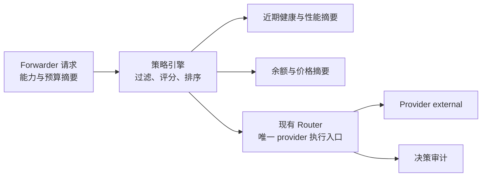

# Design: adaptive-model-routing

## Architecture



策略引擎只返回候选顺序和推理上限，不执行 provider、工具或历史写入。Router 继续负责网络尝试与渠道冷却，forwarder 继续拥有“是否已经产生可见输出或副作用”的事实。

## Interfaces

- `ProxyService.GetRoutingPolicy()`、`SaveRoutingPolicy(policy RoutingPolicy)`
  - Output: 归一化策略。
  - Error codes: `routing_policy_invalid`、`routing_policy_save_failed`。
  - Invariants: 金额使用 USD 微单位整数；权重为 0 到 100 的整数且总和大于 0。

- `ProxyService.PreviewRoutingDecision(request RoutingPreviewRequest)`
  - Input: 模型、能力需求、上下文 token 估算和可选会话匿名 ID，不含 prompt。
  - Output: `RoutingDecisionPreview`。
  - Error codes: `routing_no_candidate`、`routing_requirement_invalid`。
  - Invariants: 只读，不调用 provider、不改变健康状态、不消耗余额。

- `ProxyService.GetRoutingDecisionHistory(query RoutingDecisionQuery)`
  - Output: `RoutingDecisionPage`。
  - Error codes: `routing_history_read_failed`。
  - Invariants: 不含正文、密钥或完整请求 ID。

- 内部 `RoutingPolicyEngine.Rank(request RoutingRequest) RoutingDecision`
  - Input: 渠道候选、能力、近期指标、余额摘要、预算和会话亲和信息。
  - Output: 有序候选、原因码和实际推理上限。
  - Invariants: 不修改候选、配置、健康状态或余额；相同输入必须得到相同排序。

```go
type RoutingPolicy struct {
    Enabled                 bool   `json:"enabled"`
    Strategy                string `json:"strategy"`
    SessionAffinity         bool   `json:"sessionAffinity"`
    MaxFailoverAttempts     int    `json:"maxFailoverAttempts"`
    DailyBudgetMicrosUSD    int64  `json:"dailyBudgetMicrosUsd,omitempty"`
    SessionBudgetMicrosUSD  int64  `json:"sessionBudgetMicrosUsd,omitempty"`
    MinimumBalanceMicrosUSD int64  `json:"minimumBalanceMicrosUsd,omitempty"`
    MaximumThinkingEffort   string `json:"maximumThinkingEffort,omitempty"`
    LatencyWeight           int    `json:"latencyWeight"`
    CostWeight              int    `json:"costWeight"`
    ReliabilityWeight       int    `json:"reliabilityWeight"`
    BalanceWeight           int    `json:"balanceWeight"`
    CapabilityRules         []RoutingCapabilityRule `json:"capabilityRules,omitempty"`
}

type RoutingCapabilityRule struct {
    Capability          string   `json:"capability"`
    Required            bool     `json:"required"`
    PreferredChannelIDs []string `json:"preferredChannelIds,omitempty"`
}

type RoutingRequirement struct {
    Capability string `json:"capability"`
    Required   bool   `json:"required"`
}

type RoutingPreviewRequest struct {
    ModelID               string               `json:"modelId"`
    EstimatedContextTokens int64               `json:"estimatedContextTokens,omitempty"`
    SessionHash           string               `json:"sessionHash,omitempty"`
    Requirements          []RoutingRequirement `json:"requirements,omitempty"`
}

type RoutingRequest struct {
    RequestHash             string                  `json:"requestHash"`
    ModelID                string                  `json:"modelId"`
    EstimatedContextTokens int64                   `json:"estimatedContextTokens,omitempty"`
    SessionHash            string                  `json:"sessionHash,omitempty"`
    Requirements           []RoutingRequirement    `json:"requirements,omitempty"`
    Candidates             []RoutingCandidateInput `json:"candidates"`
}

type RoutingCandidateInput struct {
    ChannelID                string `json:"channelId"`
    ConfigOrder              int    `json:"configOrder"`
    Available                bool   `json:"available"`
    Cooldown                 bool   `json:"cooldown"`
    RecentTTFTMS             int64  `json:"recentTtftMs,omitempty"`
    RecentSuccessBasisPoints int    `json:"recentSuccessBasisPoints,omitempty"`
    EstimatedCostMicrosUSD   int64  `json:"estimatedCostMicrosUsd,omitempty"`
    PricingKnown             bool   `json:"pricingKnown"`
    BalanceMicrosUSD         int64  `json:"balanceMicrosUsd,omitempty"`
    BalanceKnown             bool   `json:"balanceKnown"`
    Capabilities             []string `json:"capabilities,omitempty"`
}

type RoutingCandidateScore struct {
    ChannelID                  string   `json:"channelId"`
    Eligible                   bool     `json:"eligible"`
    Score                      int      `json:"score"`
    ReasonCodes                []string `json:"reasonCodes"`
    RecentTTFTMS               int64    `json:"recentTtftMs,omitempty"`
    RecentSuccessBasisPoints   int      `json:"recentSuccessBasisPoints,omitempty"`
    EstimatedCostMicrosUSD     int64    `json:"estimatedCostMicrosUsd,omitempty"`
    PricingKnown               bool     `json:"pricingKnown"`
}

type RoutingDecisionPreview struct {
    DecisionID string                  `json:"decisionId"`
    Strategy   string                  `json:"strategy"`
    Candidates []RoutingCandidateScore `json:"candidates"`
}

type RoutingDecision struct {
    DecisionID              string                  `json:"decisionId"`
    Candidates              []RoutingCandidateScore `json:"candidates"`
    EffectiveThinkingEffort string                  `json:"effectiveThinkingEffort,omitempty"`
}

type RoutingDecisionQuery struct {
    ModelID    string `json:"modelId,omitempty"`
    ChannelID  string `json:"channelId,omitempty"`
    Result     string `json:"result,omitempty"`
    FromUnixMS int64  `json:"fromUnixMs,omitempty"`
    ToUnixMS   int64  `json:"toUnixMs,omitempty"`
    Limit      int    `json:"limit"`
    Cursor     string `json:"cursor,omitempty"`
}

type RoutingDecisionRecord struct {
    DecisionID             string                  `json:"decisionId"`
    TimestampUnixMS        int64                   `json:"timestampUnixMs"`
    ModelID                string                  `json:"modelId"`
    Strategy               string                  `json:"strategy"`
    SelectedChannelID      string                  `json:"selectedChannelId,omitempty"`
    Candidates             []RoutingCandidateScore `json:"candidates"`
    AttemptCount           int                     `json:"attemptCount"`
    Result                 string                  `json:"result"`
    DurationMS             int64                   `json:"durationMs,omitempty"`
    InputTokens            int64                   `json:"inputTokens,omitempty"`
    OutputTokens           int64                   `json:"outputTokens,omitempty"`
    EstimatedCostMicrosUSD int64                   `json:"estimatedCostMicrosUsd,omitempty"`
}

type RoutingDecisionPage struct {
    Items      []RoutingDecisionRecord `json:"items"`
    NextCursor string                  `json:"nextCursor,omitempty"`
}
```

`strategy` 仅允许 `manual`、`balanced`、`latency`、`cost`、`stability`。自动 failover 仅允许发生在尚未向 Cursor 发布正文、思考增量、工具调用或其它外部副作用之前。
`MaxFailoverAttempts` 允许 0 到 5；金额字段必须大于等于 0；`Limit` 允许 1 到 200，默认 50；决策结果仅允许 `succeeded`、`failed`、`canceled`。

## Data Model

- `RoutingPolicy` 作为 `Config.Routing.Policy` 子树持久化；旧配置只有 `mode` 时默认 `enabled=false`。
- 渠道短期冷却仍由 Router 内存状态所有，控制中心只读。
- 决策审计记录 `decisionId`、匿名请求哈希、候选、原因码、最终渠道、尝试次数、终态、耗时、token 和费用微单位。
- 未知价格必须标记 `pricingKnown=false`，不得以 0 表示免费。
- 成功率使用基点整数，权重和分数使用整数，稳定排序以配置顺序和渠道 ID 作为最终 tie-breaker。

## Key Decisions

- Problem: 自动路由能降低成本和延迟，但请求可能已经输出文本或调用写文件、Shell、MCP 等工具；切换渠道重放会重复输出或副作用。
  Solution: forwarder 向 Router 提供不可逆的 `observableOrSideEffectStarted` 状态；状态为真后禁止整轮 failover。
  Cost: 部分中途网络错误不能自动切换，用户需要重试。
  Why not the alternatives: 无条件 failover 风险不可接受；完全禁止 failover 浪费多渠道基础；仅依据 HTTP 错误码无法判断副作用。

## Migration / Compatibility

- 新策略默认关闭，现有选择、冷却与 failover 行为不变。
- 现有模型组顺序在 `manual` 策略中仍是唯一顺序来源。
- 决策历史是新增安全摘要，删除或停用不影响请求执行。
