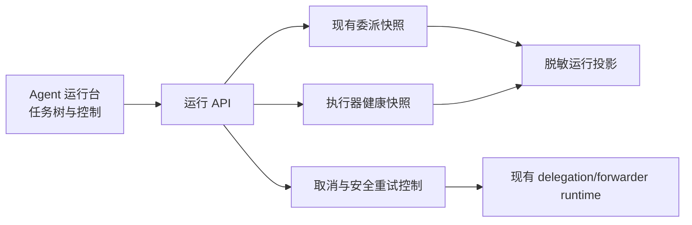

# Design: agent-operations-console

## Architecture



运行台不创建第二套调度器。活动任务、状态、取消和执行器 failover 继续由现有 runtime 所有；页面只消费安全投影，并把用户动作路由回既有控制链。

## Interfaces

本设计复用总控设计中定义的 `PreparedOperation` 与 `OperationResult`，字段和枚举不得在 Agent 域另行扩展。

- `ProxyService.GetAgentRuns(query AgentRunQuery)`
  - Output: `AgentRunPage`。
  - Error codes: `agent_runs_unavailable`。
  - Invariants: 不返回 prompt、工具参数、工作区路径、完整请求 ID 或模型输出。

- `ProxyService.GetAgentRun(runID string)`
  - Output: `AgentRunDetail`。
  - Error codes: `agent_run_not_found`。
  - Invariants: 子任务和执行器尝试均来自既有稳定身份；不得按标题、数组顺序或完成顺序补齐关系。

- `ProxyService.CancelAgentRun(runID string)`
  - Output: `OperationResult`。
  - Error codes: `agent_run_not_found`、`agent_run_not_cancelable`、`agent_cancel_failed`。
  - Invariants: 子任务取消不取消兄弟任务；父级停止使用独立 aggregate ID。

- `ProxyService.PrepareAgentRunRetry(runID string)`、`ExecuteAgentRunRetry(confirmationToken string)`
  - Output: `AgentRetryPreparation`、`AgentRetryResult`。
  - Error codes: `agent_run_not_retryable`、`agent_retry_payload_unavailable`、`agent_retry_side_effect_risk`、`confirmation_expired`。
  - Invariants: 仅允许失败终态、执行器标记 `retrySafe=true`、未观察到副作用且原任务输入仍在当前进程受限内存中；不得为跨重启重试持久化 prompt。

- `ProxyService.ExportSanitizedAgentRunReport(runID string)`
  - Output: `{ path: string, sha256: string }`。
  - Invariants: 只导出阶段、状态、执行器尝试、错误码、耗时、token 和费用微单位；不等同于会话 debug bundle。

```go
type AgentRunSummary struct {
    RunID              string `json:"runId"`
    ParentRunID        string `json:"parentRunId,omitempty"`
    AggregateID        string `json:"aggregateId,omitempty"`
    Status             string `json:"status"`
    Phase              string `json:"phase,omitempty"`
    ModelName          string `json:"modelName,omitempty"`
    ExecutorID         string `json:"executorId,omitempty"`
    ToolCallCount      int    `json:"toolCallCount"`
    AttemptCount       int    `json:"attemptCount"`
    DurationMS         int64  `json:"durationMs,omitempty"`
    Cancelable         bool   `json:"cancelable"`
    Retryable          bool   `json:"retryable"`
    SideEffectObserved bool   `json:"sideEffectObserved"`
    ErrorCode          string `json:"errorCode,omitempty"`
    UpdatedAtUnixMS    int64  `json:"updatedAtUnixMs"`
}

type AgentRunQuery struct {
    Status     string `json:"status,omitempty"`
    ExecutorID string `json:"executorId,omitempty"`
    FromUnixMS int64  `json:"fromUnixMs,omitempty"`
    ToUnixMS   int64  `json:"toUnixMs,omitempty"`
    Limit      int    `json:"limit"`
    Cursor     string `json:"cursor,omitempty"`
}

type AgentExecutorAttempt struct {
    ExecutorID       string `json:"executorId"`
    Attempt          int    `json:"attempt"`
    Status           string `json:"status"`
    FailureClass     string `json:"failureClass,omitempty"`
    RetrySafe        bool   `json:"retrySafe"`
    DiagnosticCode   string `json:"diagnosticCode,omitempty"`
    StartedAtUnixMS  int64  `json:"startedAtUnixMs,omitempty"`
    FinishedAtUnixMS int64  `json:"finishedAtUnixMs,omitempty"`
}

type AgentRunDetail struct {
    Summary  AgentRunSummary        `json:"summary"`
    Attempts []AgentExecutorAttempt `json:"attempts,omitempty"`
    Children []AgentRunSummary      `json:"children,omitempty"`
}

type AgentRunPage struct {
    Items      []AgentRunSummary `json:"items"`
    NextCursor string            `json:"nextCursor,omitempty"`
}

type AgentRetryPreparation struct {
    PreparedOperation
    Run                AgentRunSummary `json:"run"`
    OriginalInputAlive bool            `json:"originalInputAlive"`
    RetrySafe          bool            `json:"retrySafe"`
}

type AgentRetryResult struct {
    OperationResult
    NewRunID string `json:"newRunId,omitempty"`
}
```

`Limit` 允许 1 到 200，默认 50。运行状态仅允许 `queued`、`running`、`backgrounded`、`waiting`、`succeeded`、`failed`、`canceled`、`timed_out`。运行详情通过同一列表项的 `runId` 按需获取，不把所有子任务和尝试塞入首屏列表。

## Data Model

- 活动运行继续由 delegation/forwarder runtime 所有；控制台使用不透明 ID 投影。
- 历史摘要可从现有指标和安全运行记录派生，不新增任务正文存储。
- `sideEffectObserved` 一旦为真不得回退；来源包含写文件、删除、Patch/Edit、Shell、MCP、ComputerUse 和其它明确外部副作用。
- 页面中的父子关系优先使用既有 aggregate、parent request 和 parent exec 关系；不得按标题或完成顺序匹配。

## Key Decisions

- Problem: 自动重试 Agent 看起来便利，但失败前可能已经改文件、执行命令或调用外部 MCP；简单重放任务会重复副作用。
  Solution: 重试使用两阶段确认，并要求 runtime 同时证明执行器可安全重试、未观察到副作用、原始输入仍在受限内存。
  Cost: 应用重启后和存在副作用的任务不能一键重试。
  Why not the alternatives: 持久化完整任务输入扩大敏感数据面；无条件重试不安全；完全不提供重试会丢失对纯读取失败任务的恢复价值。

## Migration / Compatibility

- 复用现有 `GetDelegationTaskSnapshots`、执行器探测和取消接口；旧设置页面继续可用。
- 蓝色子代理引用的点击、滚动和高亮仍由 Cursor 客户端负责，运行台不实现聊天渲染器。
- 运行报告是新增的无正文报告，不改变现有 debug bundle。
