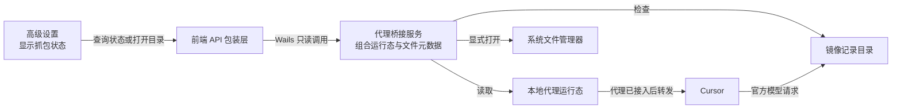

# Design: backend-capability-ui-discovery

## Architecture

状态查询只暴露运行条件和记录文件元数据。用户主动点击后，系统文件管理器打开镜像目录；记录正文始终停留在本地文件，不经过前端。

## Interfaces

- `ProxyService.GetMirrorCaptureStatus()`
  - Input: 无。
  - Output: `{ enabled: boolean, backendRunning: boolean, proxyRunning: boolean, cursorSettingsApplied: boolean, ready: boolean, recordPath: string, fileExists: boolean, sizeBytes: number, modifiedAtUnixMs: number }`。
  - Error codes: 无；目录或文件不存在时以 `fileExists: false`、`sizeBytes: 0`、`modifiedAtUnixMs: 0` 表示，不创建文件。其他文件系统读取错误返回 Wails 调用错误。
  - Invariants: `ready` 仅在 `enabled && backendRunning && proxyRunning && cursorSettingsApplied` 时为真；绝不返回记录正文、URL、请求头、请求体或响应体。

- `WindowService.OpenMirrorCaptureDirectory()`
  - Input: 无。
  - Output: 无。
  - Error codes: 无；确保目录存在后调用现有跨平台目录打开机制。
  - Invariants: 只打开 `<historyRoot>/_debug/mirror`，不读取、不导出、不复制记录文件。

## Data Model

- 镜像状态为派生 DTO，不持久化。
- 记录路径固定为应用 history 根目录下的 `_debug/mirror/official.raw.jsonl`。
- 文件元数据只包括是否存在、字节大小和 Unix 毫秒级最后修改时间。

## Key Decisions

- Problem: 用户已启用抓包时，服务运行状态无法说明 Cursor 是否真正经由本地代理，也无法说明是否已有官方请求命中，排障仍依赖手工检查配置和文件。
  Solution: 将运行条件与记录文件元数据汇总成一个只读状态，在开关附近展示当前阻塞点或已命中结果。
  Cost: 增加一个前后端合同和一次轻量文件元数据读取。
  Why not the alternatives: 只保留开关不能定位链路断点；把 JSONL 原文嵌入应用会扩大敏感内容暴露范围。

## Migration / Compatibility

- 不迁移配置或历史文件；缺少记录文件按“等待官方模型请求”展示。
- 既有开关、代理修复和日志目录入口保持原语义。
