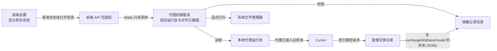
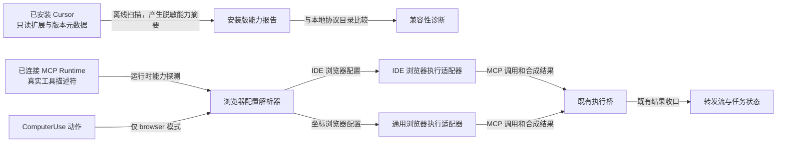

# Design: backend-capability-ui-discovery

## Architecture

状态查询只暴露运行条件和记录文件元数据。用户主动点击后，系统文件管理器打开镜像目录；记录正文始终停留在本地文件，不经过前端。

路由模式与传输路径必须分开表达：`upstream` 选择业务请求的官方上游，并在未启动本地服务时允许 Cursor 直接访问官方服务；但只要用户启动本地服务且 Cursor 代理设置仍生效，请求仍会先经过本地 MITM。此时镜像域名只旁路记录并直通官方模型 API，Cursor relay 域名则须由显式的路由策略决定是否交给 backend。

## Interfaces

- `ProxyService.GetMirrorCaptureStatus()`
  - Input: 无。
  - Output: `{ enabled: boolean, backendRunning: boolean, proxyRunning: boolean, cursorSettingsApplied: boolean, ready: boolean, recordPath: string, fileExists: boolean, sizeBytes: number, modifiedAtUnixMs: number }`。
  - Error codes: 无；目录或文件不存在时以 `fileExists: false`、`sizeBytes: 0`、`modifiedAtUnixMs: 0` 表示，不创建文件。其他文件系统读取错误返回 Wails 调用错误。
  - Invariants: `ready` 仅在 `enabled && backendRunning && proxyRunning && cursorSettingsApplied` 时为真；绝不返回记录正文、URL、请求头、请求体或响应体。

- `WindowService.OpenMirrorCaptureDirectory()`
  - Input: 无。
  - Output: 无。
  - Error codes: 无；确保目录存在后调用现有跨平台目录打开机制。
  - Invariants: 只打开 `<historyRoot>/_debug/mirror`，不读取、不导出、不复制记录文件。

- 本地镜像记录关联
  - Input: 解密后的 `http.Request` 和其共享的 `goproxy.ProxyCtx`；后续响应与同一 `ProxyCtx`。
  - Output: JSONL 记录新增 `{ exchangeId, phase, model? }`。`phase` 仅允许 `request`、`response_start`、`response_chunk`、`response_truncated`。
  - Invariants: `exchangeId` 只在本进程内生成并写入本地 JSONL，不进入任何官方 HTTP 头、URL 或请求体；同一 `ProxyCtx` 的所有记录使用同一 ID；`model` 从已有请求 JSON 或 Gemini URL 尽力解析，解析失败留空且不影响转发。

- 本地镜像请求 URL 脱敏
  - Input: 原始 `http.Request.URL`。
  - Output: 仅用于 JSONL 的 URL 字符串；保留路径和非敏感查询参数。
  - Invariants: `key`、`api_key`、`apikey`、`token`、`access_token`、`refresh_token`、`secret`、`signature`、`sig`、`password` 与 `pass` 等参数值写为 `[REDACTED]`；实际 `http.Request.URL` 不被修改，Gemini 模型路径提取继续使用原始 URL。

- 路由模式与 MITM 传输状态
  - Input: 已归一化的 `routing.mode`、本地服务运行态和 Cursor 代理设置状态。
  - Output: 页面使用“官方上游”与“本地服务”描述业务去向，并单独显示是否仍经本地 MITM；镜像状态只在本地代理实际运行且已写入 Cursor 设置时宣称可捕获。
  - Invariants: 不以 `routing.mode === upstream` 推断 Cursor 已绕过本地代理；不得因更正界面文案而改变用户已启动服务时的镜像记录能力；未启动服务时不能显示“等待官方模型请求”。

- 隔离协议保真记录
  - Input: 仅 `CURSOR_E2E_MIRROR_CAPTURE=1` 运行的隔离代理中，已脱敏 HTTP 元数据和原始请求/响应 bytes。
  - Output: 镜像 JSONL 新增 `bodyEncoding`、`bodyBytes`、`bodySHA256`、可选 `bodyBase64`，以及仅用于隔离模式的 `protocol` 摘要。二进制内容只使用 Base64，文本内容可保留既有 `body` 字段。
  - Invariants: 每份 bytes 只能由一种载荷字段表示；Base64 解码必须等于原输入；认证头、Cookie、URL 凭据一律不进入载荷或摘要；普通镜像模式不写上述保真字段。

- Bidi 与 Agent 摘要
  - Input: `application/proto` 的 `BidiAppendRequest` 原始 bytes，及其可选 `data_binary`。
  - Output: `{ requestIdHash, appendSeqno, clientMessageKind, agentMode, multitask, subagentAction?, decodeError? }`。
  - Invariants: 外层 `request_id` 只写哈希；不写 prompt、完整 ID、文件路径、凭据或原始 protobuf 的 JSON 展开；解析失败不影响保真 bytes 落盘或官方直通。

- RunSSE 帧与时间线
  - Input: `application/connect+proto` 或 SSE 响应流 bytes。
  - Output: 每个协议帧一条记录 `{ exchangeId, direction, sequence, frameEncoding, frameBytes, frameSHA256, serverMessageKind?, decodeError? }`，并在独立索引中以 `requestIdHash` 聚合。
  - Invariants: 协议帧不是底层读取块；同一 `requestIdHash` 的事件按局部序号递增；不同并发请求不共享序号或索引桶；响应上限命中必须以 `response_truncated` 明示。

## Data Model

- 镜像状态为派生 DTO，不持久化。
- 记录路径固定为应用 history 根目录下的 `_debug/mirror/official.raw.jsonl`。
- 文件元数据只包括是否存在、字节大小和 Unix 毫秒级最后修改时间。
- 每条 JSONL 记录保留现有字段，并新增内部关联字段：`exchangeId`、`phase`、`model`。已有记录没有这些字段时仍可按旧格式读取。
- 隔离保真字段为向后兼容的可选字段；没有 `bodyEncoding` 的旧记录保持原解释，禁止把旧 `body` 重新解释为完整原始二进制。
- 协议时间线与原镜像记录分文件保存，均位于隔离临时根目录下的 `_debug/mirror`，不进入普通 history。

## Key Decisions

- Problem: 用户已启用抓包时，服务运行状态无法说明 Cursor 是否真正经由本地代理，也无法说明是否已有官方请求命中，排障仍依赖手工检查配置和文件。
  Solution: 将运行条件与记录文件元数据汇总成一个只读状态，在开关附近展示当前阻塞点或已命中结果。
  Cost: 增加一个前后端合同和一次轻量文件元数据读取。
  Why not the alternatives: 只保留开关不能定位链路断点；把 JSONL 原文嵌入应用会扩大敏感内容暴露范围。

- Problem: 同一官方请求的响应起始、流式片段与截断事件没有事务归属；并发请求下按时间匹配会把响应正文关联到错误请求，误导后续 Cursor 对接分析。
  Solution: 请求过滤器生成一枚内部交换 ID 并保存在 `ProxyCtx.UserData`，响应过滤器读取同一 ID；记录器为每行写入阶段枚举与可选模型元数据。
  Cost: JSONL 每行增加少量元数据，并需要维护四类事件阶段的一致性。
  Why not the alternatives: 仅按时间戳无法可靠区分并发流；将关联 ID 插入上游请求会改变官方 API 交互，风险不可接受。

## Migration / Compatibility

- 不迁移配置或历史文件；缺少记录文件按“等待官方模型请求”展示。
- 既有开关、代理修复和日志目录入口保持原语义。
- 现有 `upstream` 配置不迁移；只更正其运行态解释，并让代理分流按同一配置源作出明确决策。

## 已安装 Cursor 兼容机制

安装版扫描与运行时执行严格分离。扫描只回答“当前安装版本声明了哪些已知能力”，不会修改安装目录、加载扩展代码、复制 bundle、读取用户状态库或尝试伪造 Cursor 客户端消息。真正执行仍只能使用当前已连接 MCP runtime 在 `tools/list` 中返回的工具描述符。

本机只读核验的安装版为 `D:\cursor\Cursor.exe`，文件版本 `3.15.6`。其 `cursor-browser-automation` 扩展声明为 Cursor 的浏览器自动化 MCP 服务，且 bundle 可见 `cursor-ide-browser` 与 `browser_tabs`、`browser_navigate`、`browser_lock`、`browser_snapshot`、`browser_click`、`browser_type`、`browser_fill`、`browser_select_option`、`browser_press_key`、`browser_scroll`、`browser_drag`、`browser_take_screenshot`、`browser_cdp`、`browser_mouse_click_xy`。这只构成版本化静态兼容证据；任何一个工具是否在特定会话可用，仍以运行时描述符为准。

### Interfaces

- `cursor capability scan` 开发诊断入口
  - Input: 可选 `cursorRoot`；省略时仅按当前平台的候选安装根目录查找，不递归扫描任意磁盘。
  - Output: `{ scannerVersion: string, cursorVersion?: string, installRootHash?: string, extensions: [{ id: string, version?: string }], protocolMarkers: string[], browserToolMarkers: string[], comparedCapabilities: [{ protocolName: string, localStatus: "implemented" | "control" | "unsupported" | "unknown", installedEvidence: "declared" | "absent" | "not_scanned" }], warnings: string[] }`。
  - Error codes: `cursor_install_not_found`、`cursor_metadata_unreadable`、`extension_manifest_unreadable`、`extension_bundle_unreadable`。缺少单个扩展只生成 warning，不中断其余摘要。
  - Invariants: 不输出绝对安装路径、完整 bundle 文本、用户目录、Cookie、Token、URL、请求/响应或工具参数；`installRootHash` 是本地路径的不可逆摘要；扫描不写入安装目录，也不影响 Cursor 进程。

- `MCPCaller.ResolveBrowserServer(scope)`
  - Input: MCP runtime scope。
  - Output: `{ identifier: string, profile: "cursor_ide_browser" | "coordinate_browser", toolNames: string[] }` 或 `browser_mcp_not_compatible`。
  - Error codes: `browser_mcp_not_connected`、`browser_mcp_profile_incomplete`、`browser_mcp_ambiguous`。
  - Invariants: 仅从已连接 runtime 的 `tools/list` 描述符判断；不得仅凭服务显示名中含 `browser` 或 `playwright` 选中服务。优先精确标识 `cursor-ide-browser`，其余服务只有满足坐标型工具集合时才可成为 `coordinate_browser`。

- `IDEBrowserExecutor.Execute(actions)`
  - Input: ComputerUse 归一化动作序列与 `cursor_ide_browser` profile。
  - Output: 既有 `computeruse.Result`，只含成功状态、动作数、耗时、稳定错误码和可选截图；不把标签 URL、可访问性树、`ref`、CDP 内容或 MCP 文本结果写入日志、调试记录或模型回放。
  - Error codes: `ide_browser_no_tab`、`ide_browser_action_unmappable`、`ide_browser_lock_failed`、`ide_browser_snapshot_failed`、`ide_browser_action_failed`、`ide_browser_unlock_failed`。
  - Invariants: 对已有标签的长操作遵循“列出标签 -> 锁定 -> 操作 -> 解锁”；无可操作标签时只在显式初始地址不是 `about:blank` 时导航创建标签。坐标点击必须先获取本轮截图，再使用安装版声明的坐标点击工具；需要元素语义但 ComputerUse 未提供可稳定映射依据的动作必须失败，不得猜测 `ref`、改用系统鼠标或静默跳到其他标签。

- `CoordinateBrowserExecutor.Execute(actions)`
  - Input: ComputerUse 归一化动作序列与 `coordinate_browser` profile。
  - Output: 既有 `computeruse.Result`。
  - Error codes: 保持既有浏览器 MCP 错误语义。
  - Invariants: 只在 runtime 声明坐标点击、键盘、等待与截图所需工具时选择；现有 Playwright MCP 参数映射不变。

- 子代理后台化、等待与审批控制
  - Input: 已有 `ForceBackgroundSubagent`、`SubagentAwait`、Shell/MCP/WebFetch allowlist precheck 的 protobuf oneof。
  - Output: 保持现有执行桥的 pending、结果与终态语义；另生成不含内容的状态枚举 `background_accepted`、`background_not_found`、`await_still_running`、`await_complete`、`await_not_found`、`await_error`、`allowlist_allowed`、`allowlist_denied`。
  - Error codes: 不新增协议外错误；未由 Cursor 客户端下发的 oneof 保持 `not_observed`，不得合成请求来凑覆盖率。
  - Invariants: `await_still_running` 绝不关闭 pending；allowlist 放行不等同工具完成；allowlist 拒绝必须终态收口；父级 Stop All 与单子代理取消继续走既有独立控制链路。

### Data Model

- `InstalledCursorCapabilityReport` 仅为命令输出或本地临时诊断对象，不写入应用配置、会话 history、镜像 JSONL 或 Git。
- `BrowserMCPProfile` 只允许 `cursor_ide_browser`、`coordinate_browser`；不提供“未知但尝试执行”的默认值。
- `BrowserMCPResolution` 包含 MCP identifier、profile、已验证工具名集合和诊断状态。工具名集合来自运行时 descriptors，不保存 schema、参数或服务输出。
- `ExecutionCompatibilityState` 仅保存 `profile`、`actionIndex`、`phase` 和稳定错误码，生命周期随单个 ComputerUse pending exec 结束而释放。
- `ProtocolLifecycleState` 为状态投影，不写入原始请求：后台化只记录 accepted/not_found/unknown，等待只记录 still_running/complete/not_found/error/unknown，审批只记录 allowed/denied/not_observed。

### Key Decisions

- Problem: 安装版 Cursor 的内置 IDE 浏览器服务以标签、锁、快照和元素引用为中心，而现有浏览器模式按通用 Playwright 坐标工具调用；将两者按名称模糊匹配会把错误参数发送给正确服务，或在失败后退回到不可见的桌面鼠标操作。
  Solution: 以运行时工具描述符解析为两种互斥 profile，IDE profile 采用锁与当前标签生命周期，坐标 profile 保持既有 Playwright 映射。未知或不完整 profile 直接返回稳定错误。
  Cost: 需要维护一套小型 profile 规则，并为同一 ComputerUse 动作保留两套映射。
  Why not the alternatives: 强制统一为坐标 API 与安装版服务的交互模型不符；强制统一为 ref API 则无法从通用 ComputerUse 坐标动作可靠生成 ref；不做适配会让 browser 模式继续只对部分第三方 MCP 可用。

- Problem: 从已安装 bundle 读到协议名只能证明版本中存在代码，不能证明当前 Cursor 会话选择了后台化、等待、ComputerUse 或审批路径；若据此合成上下行消息，会污染真实状态机和抓包证据。
  Solution: 静态扫描只输出版本化能力报告，执行桥只消费实际 runtime descriptors 与真实 oneof。未出现的分支明确保持 `not_observed`，通过单元协议向量验证格式，而不是伪造安装客户端行为。
  Cost: 有些分支仍需用户真实触发才能获得 E2E 验证，扫描不能立即把所有条目标为已验证。
  Why not the alternatives: 直接 patch 安装版 Cursor 会破坏签名和升级路径；以字符串命中宣称功能已运行会混淆静态支持与真实验证；什么都不扫则无法及时发现安装版升级导致的兼容漂移。

### Migration / Compatibility Addendum

- `computerUse.mode=desktop` 完全不变；`computerUse.mode=browser` 继续保留当前配置字段和初始地址，不迁移用户配置。
- 没有 `cursor-ide-browser` runtime 时，满足坐标工具要求的既有 Playwright MCP 仍使用现有适配器；两类均不可用时返回可操作错误，不退回桌面模式。
- 已有 `ForceBackgroundSubagent`、`SubagentAwait` 与 allowlist 处理函数不改协议字段；本轮只补状态投影、能力诊断和定向测试，避免与当前 pending/watchdog/取消收口相冲突。
- 安装目录和 `.cursor-app-formatted/` 均只读；任何生成的扫描报告、格式化快照和临时解析器必须被忽略且不得提交。

### Shell 工具气泡流式增量兼容

已安装版 Cursor 的 Shell UI 同时消费既有 `ShellOutputDelta` 交互事件和包裹在 `ToolCallDelta.ShellToolCallDelta` 中的 stdout/stderr 片段。转发器应在保留原有输出事件的前提下，针对非空 stdout 或 stderr 额外发送工具调用增量，并沿用 pending exec 的 `ToolCallID` 与 `ModelCallID`。启动、退出、空内容与未知事件不构造第二条消息，避免制造空的终端气泡或改变终态收口。该投影仅作用于已真实收到的客户端 Shell 输出，不改变 Shell 执行、审批、取消、历史写入或 watchdog 逻辑。
