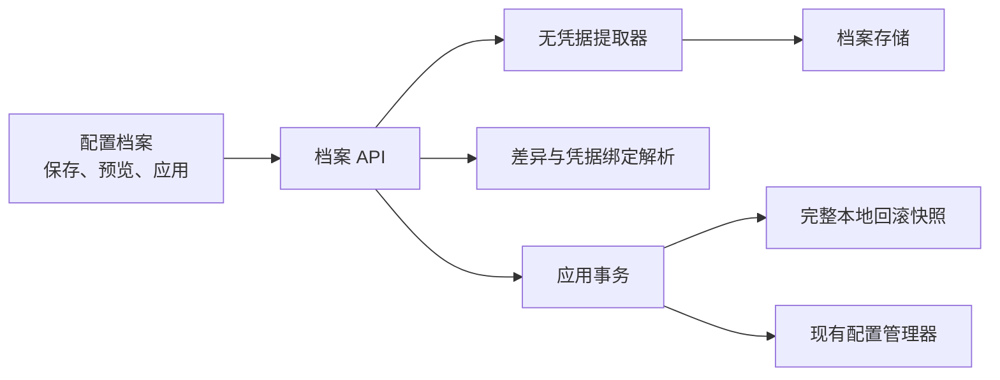

# Design: config-profiles-recovery

## Architecture



档案是可分享的无凭据配置模板；回滚快照是仅本机后端可读的完整恢复材料。两者不能合并为同一种文件或同一个导出入口。

## Interfaces

本设计复用总控设计中定义的 `PreparedOperation` 与 `OperationResult`，字段和枚举不得在档案域另行扩展。

- `ProxyService.ListConfigProfiles()`、`SaveCurrentConfigProfile(request)`、`DeleteConfigProfile(profileID)`
  - Output: `ConfigProfileSummary[]`、单个摘要或 `OperationResult`。
  - Error codes: `profile_name_invalid`、`profile_store_unreadable`、`profile_save_failed`、`profile_not_found`。
  - Invariants: 档案不保存 API Key、余额访问令牌、Cursor token、Cookie、完整路径或自定义敏感 header 值。

- `ProxyService.PreviewConfigProfile(profileID string)`
  - Output: `ConfigProfilePreview`。
  - Error codes: `profile_not_found`、`profile_schema_unsupported`。
  - Invariants: 只返回字段级变更和凭据绑定状态，不返回当前凭据值。

- `ProxyService.PrepareConfigProfileApply(profileID string)`、`ExecuteConfigProfileApply(confirmationToken string)`
  - Output: `ConfigProfileApplyPreparation`、`OperationResult`。
  - Error codes: `profile_binding_missing`、`profile_validation_failed`、`profile_backup_failed`、`profile_apply_failed`、`profile_rollback_failed`。
  - Invariants: 应用前创建完整本地快照；合并时保留当前凭据绑定，不用空值覆盖密钥；保存后重新读取和归一化校验，失败自动恢复。

- `ProxyService.ExportConfigProfile(profileID string)`、`ImportConfigProfile(content string)`
  - Output: `{ path, sha256 }` 或 `ConfigProfilePreview`。
  - Error codes: `profile_export_failed`、`profile_import_too_large`、`profile_import_invalid_schema`。
  - Invariants: 导出始终无凭据；JSON 最大 1 MiB；未知 schema 只能预览元数据，不能应用。

```go
type ConfigProfileSummary struct {
    ID              string   `json:"id"`
    Name            string   `json:"name"`
    Description     string   `json:"description,omitempty"`
    Domains         []string `json:"domains"`
    CreatedAtUnixMS int64    `json:"createdAtUnixMs"`
    UpdatedAtUnixMS int64    `json:"updatedAtUnixMs"`
}

type SaveConfigProfileRequest struct {
    Name        string   `json:"name"`
    Description string   `json:"description,omitempty"`
    Domains     []string `json:"domains"`
}

type ConfigProfileChange struct {
    Path       string `json:"path"`
    ChangeKind string `json:"changeKind"`
    Sensitive  bool   `json:"sensitive"`
}

type ProfileCredentialBinding struct {
    AdapterID string `json:"adapterId"`
    State     string `json:"state"`
}

type ConfigProfilePreview struct {
    Profile  ConfigProfileSummary       `json:"profile"`
    Changes  []ConfigProfileChange      `json:"changes"`
    Bindings []ProfileCredentialBinding `json:"bindings"`
    CanApply bool                       `json:"canApply"`
}

type ConfigProfileApplyPreparation struct {
    PreparedOperation
    Preview ConfigProfilePreview `json:"preview"`
}
```

`ProfileCredentialBinding.state` 仅允许 `resolved`、`missing`、`ambiguous`；后两者存在时禁止执行应用。
档案名称去空白后长度为 1 到 80 个 Unicode 字符，描述最长 500 个字符。`Domains` 只允许 `models`、`model_groups`、`routing`、`delegation`、`skills_mcp`、`computer_use`、`appearance`，至少选择一个且去重。

## Data Model

```text
<dataRoot>/profiles/
  index.json
  profiles/<profile-id>.json
  operations/<operation-id>/manifest.json
  backups/<operation-id>/config.snapshot
```

- 档案允许域：模型非密钥字段、模型组、路由策略、委派策略、Skills/MCP 开关与摘要、ComputerUse 模式、界面偏好。
- 档案禁止域：API Key、自定义敏感 headers、余额访问令牌、Cursor token、Cookie 和本机绝对路径。
- 回滚快照可含完整当前配置，但不经 Wails 返回、不导出、不进入 Git；成功操作保留最近 10 份。
- 档案按稳定 adapter ID 绑定当前密钥；无法解析时必须先回到模型配置页处理。

## Key Decisions

- Problem: 用户需要迁移和复用配置，但完整配置含 API Key、余额令牌和本机路径；把完整快照作为档案导出会制造新的凭据泄露入口。
  Solution: 可分享档案始终无凭据，应用时解析当前机器的密钥绑定；完整材料只存在于本地回滚快照。
  Cost: 跨设备导入后可能需要重新绑定供应商密钥。
  Why not the alternatives: 明文完整导出风险过高；密码加密凭据包会扩大密码学和恢复责任；完全不支持档案则无法提供可审计迁移和回滚。

## Migration / Compatibility

- `schemaVersion=1` 起步；未知版本不可应用。
- 档案功能不改变现有配置文件格式，应用仍通过现有配置管理器归一化和持久化。
- 回退本功能不删除档案和本地快照，避免误删用户恢复材料。
