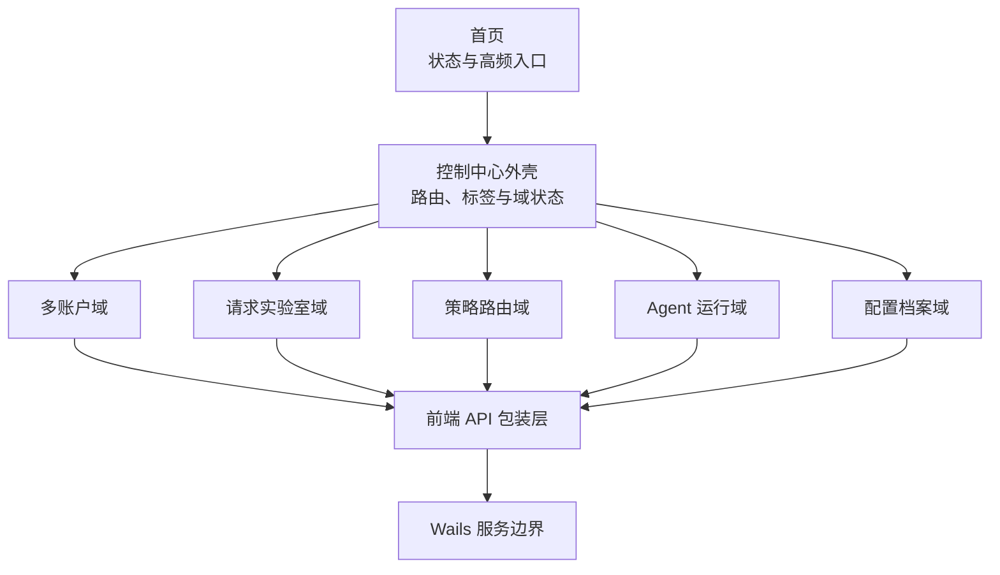

# Design: cursor-control-center-expansion

## Architecture

本变更只定义统一控制中心的外壳、跨域安全边界和子变更依赖，不承载五个业务域的完整合同。账户、请求实验室、策略路由、Agent 运行台和配置档案分别维护独立的 `design.md`，可以单独实现、验证、发布和回滚。



控制中心新增顶级路由 `/control-center`，使用紧凑标签切换五个域。首页只显示脱敏状态摘要和跳转入口；现有模型编辑器、供应商详情、历史页、诊断页和设置页继续承担原职责，不在控制中心复制完整工作流。

## Interfaces

- `ProxyService.GetControlCenterOverview()`
  - Input: 无。
  - Output: `ControlCenterOverview`。
  - Error codes: 单个域读取失败不使整体失败；对应域返回 `state=error` 和稳定错误码。
  - Invariants: 不含 API Key、Token、Cookie、原始请求正文、工具参数、完整路径或完整请求 ID。

```go
type ControlCenterDomainStatus struct {
    State           string `json:"state"`
    Count           int    `json:"count,omitempty"`
    WarningCode     string `json:"warningCode,omitempty"`
    UpdatedAtUnixMS int64  `json:"updatedAtUnixMs,omitempty"`
}

type ControlCenterOverview struct {
    Accounts   ControlCenterDomainStatus `json:"accounts"`
    RequestLab ControlCenterDomainStatus `json:"requestLab"`
    Routing    ControlCenterDomainStatus `json:"routing"`
    Agents     ControlCenterDomainStatus `json:"agents"`
    Profiles   ControlCenterDomainStatus `json:"profiles"`
}
```

- 前端路由合同
  - Input: `/control-center?tab=<tab>`。
  - Output: `tab` 仅允许 `accounts`、`request-lab`、`routing`、`agents`、`profiles`；缺失或非法值回退 `accounts`。
  - Invariants: 切换标签不销毁其它域正在执行的后端操作；离开页面时只取消该页面发起的轮询，不取消 OAuth、账户切换、Agent 或配置应用操作。

- 通用高风险操作合同
  - Input: 子域的 `Prepare*` 方法返回一次性确认令牌，`Execute*` 方法消费令牌。
  - Output: `PreparedOperation` 与 `OperationResult`。
  - Error codes: `confirmation_expired`、`confirmation_already_used`、`operation_busy`。
  - Invariants: 确认令牌 60 秒失效且只能使用一次；准备阶段不得产生被确认的副作用。

```go
type PreparedOperation struct {
    OperationID       string   `json:"operationId"`
    ConfirmationToken string   `json:"confirmationToken"`
    ExpiresAtUnixMS   int64    `json:"expiresAtUnixMs"`
    ImpactCodes       []string `json:"impactCodes"`
    RollbackAvailable bool     `json:"rollbackAvailable"`
}

type OperationResult struct {
    OperationID      string `json:"operationId"`
    State            string `json:"state"`
    ErrorCode        string `json:"errorCode,omitempty"`
    Retryable        bool   `json:"retryable,omitempty"`
    RollbackState    string `json:"rollbackState,omitempty"`
    FinishedAtUnixMS int64  `json:"finishedAtUnixMs"`
}
```

`OperationResult.state` 仅允许 `succeeded`、`failed`、`rolled_back`、`rollback_failed`。

## Data Model

- 控制中心概览为读取时派生 DTO，不持久化。
- 前端只保存当前标签和各域的视图偏好，不保存业务数据副本。
- 所有新 Wails 方法继续经 `clientApi.js` 或 `runtimeControlApi.js` 调用，页面不得直接导入 bindings。
- 稳定错误码使用小写下划线格式；用户可见文案由现有静态 i18n 管理。
- 不透明业务 ID 只由后端生成，前端不得从 ID 推导路径、请求标识或账户凭据。

## Key Decisions

- Problem: 五类能力都需要统一入口，但分别处理凭据、原始抓包、模型副作用和配置恢复；若共享一个业务 store 或通用 CRUD 服务，一处序列化错误可能把敏感数据带到无关页面。
  Solution: 只统一路由、标签、概览和高风险操作状态，业务合同按五个子变更隔离。
  Cost: DTO 和加载状态数量增加，实施需要按域集成。
  Why not the alternatives: 巨型控制台难以安全审计；继续完全分散则无法提供统一可发现性；保持现状无法闭环多账户、路由解释和配置恢复。

## Sub-change Boundaries

| 子变更 | 设计文件 | 主要所有权 |
| --- | --- | --- |
| 多账户与 Cursor 切换 | `../cursor-multi-account-management/design.md` | 凭据、账户库、客户端切换事务 |
| 请求实验室 | `../request-comparison-lab/design.md` | 抓包与 provider 证据的脱敏结构对比 |
| 自适应模型路由 | `../adaptive-model-routing/design.md` | 候选评分、预算、failover 边界与决策审计 |
| Agent 运行台 | `../agent-operations-console/design.md` | 委派快照、取消、安全重试与运行报告 |
| 配置档案与恢复 | `../config-profiles-recovery/design.md` | 无凭据档案、预览、应用和回滚 |

子变更之间没有实现级强依赖。推荐顺序为账户、请求实验室、路由、Agent、档案；控制中心外壳可在第一个子变更实现时落地。

## Migration / Compatibility

- 首页账户卡片和现有设置入口至少保留一个发布周期，并跳转到对应控制中心标签。
- 新增子变更默认关闭或无侵入读取；未完成的标签显示不可用状态，不提供空壳按钮。
- 每个子域独立提交与回退；回退任一子域不影响其它标签和现有页面。
- 本设计不修改现有 `backend-capability-ui-discovery`，请求实验室只复用其已经批准的本地证据边界。
