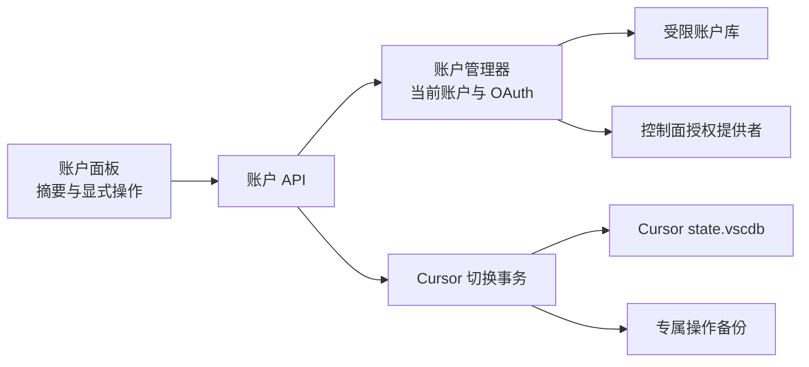

# Design: cursor-multi-account-management

## Architecture



助手控制面当前账户和 Cursor 客户端实际登录态保持两个明确概念。设置当前账户只改变插件、Skills、MCP 等控制面授权；只有用户显式执行“切换到 Cursor”时才关闭 Cursor、备份数据库、写入认证白名单并重启。

## Interfaces

本设计复用总控设计中定义的 `PreparedOperation` 与 `OperationResult`，字段和枚举不得在账户域另行扩展。

- `ProxyService.ListCursorAccounts()`
  - Output: `CursorAccountSummary[]`。
  - Error codes: `account_store_unreadable`、`account_index_rebuild_failed`。
  - Invariants: 不返回 access token、refresh token、Cookie、数据库路径或完整认证 JSON。

- `ProxyService.BeginCursorAccountLogin()`、`GetCursorAccountLoginStatus(sessionID)`、`CancelCursorAccountLogin(sessionID)`
  - Output: `CursorAccountLoginSession`、`CursorAccountLoginStatus`、`OperationResult`。
  - Error codes: `account_login_start_failed`、`account_login_session_not_found`、`account_login_cancel_failed`。
  - Invariants: 新登录取消旧的等待会话；成功只保存到账户库，不修改 Cursor 客户端。

- `ProxyService.ImportCursorAccount(request CursorAccountImportRequest)`
  - Input: `mode` 仅允许 `local_cursor`、`token`、`recovery_json`；Token 最大 8 KiB，JSON 最大 1 MiB。
  - Output: `CursorAccountSummary`。
  - Error codes: `account_import_empty`、`account_import_too_large`、`account_import_invalid_schema`、`account_import_identity_unavailable`、`account_import_local_state_missing`。
  - Invariants: 本机导入只读认证白名单；相同 `authId` 优先合并，次级去重不得覆盖更新的非空 refresh token。

- `ProxyService.PrepareCursorAccountRecoveryExport(request CursorAccountRecoveryExportRequest)`
  - Input: 1 至 100 个不重复账户 ID；准备阶段保存不可变的账户选择摘要，不读取或序列化凭据。
  - Output: `PreparedOperation`，`ImpactCodes` 必须包含 `credential_file_created`。
  - Error codes: `account_export_empty`、`account_export_too_many`、`account_not_found`、`account_export_busy`。
  - Invariants: 准备阶段不创建文件、不返回凭据；确认令牌 60 秒失效且只能使用一次。

- `ProxyService.ExecuteCursorAccountRecoveryExport(confirmationToken, destinationPath string)`
  - Output: `CursorAccountRecoveryExportResult`；不得返回文件正文或任何 token。
  - Error codes: `confirmation_expired`、`account_export_destination_invalid`、`account_export_write_failed`。
  - Invariants: 后端按准备阶段冻结的账户集合生成版本化 JSON，以目标目录中的临时文件加 rename 写入并限制文件权限；日志只记录账户数量、结果和脱敏后的目标文件名，不记录正文。

- `ProxyService.SetCurrentCursorAccount(accountID string)`
  - Output: `CursorAccountSummary`。
  - Error codes: `account_not_found`、`account_unusable`。
  - Invariants: 只改变控制面授权，不修改 Cursor 客户端。

- `ProxyService.PrepareCursorClientAccountSwitch(accountID string)`
  - Output: `CursorAccountSwitchPreparation`。
  - Error codes: `account_not_found`、`cursor_state_db_missing`、`cursor_process_probe_failed`、`account_switch_busy`。
  - Invariants: 准备阶段不关闭进程、不写数据库、不创建备份。

- `ProxyService.ExecuteCursorClientAccountSwitch(confirmationToken string)`
  - Output: `CursorAccountSwitchResult`。
  - Error codes: `confirmation_expired`、`cursor_process_close_failed`、`account_switch_backup_failed`、`account_switch_write_failed`、`account_switch_verify_failed`、`cursor_restart_failed`、`account_switch_rollback_failed`。
  - Invariants: 备份、白名单写入、读回校验、当前账户更新和重启构成一个事务；失败恢复数据库文件和切换前当前账户。

- `ProxyService.UpdateCursorAccountTags(accountID, tags)`、`DeleteCursorAccounts(request)`
  - Invariants: 删除助手账户不退出 Cursor；删除当前账户必须选择新账户或确认清空当前指针。

```go
type CursorAccountSummary struct {
    ID               string   `json:"id"`
    Email            string   `json:"email,omitempty"`
    AuthIDHint       string   `json:"authIdHint,omitempty"`
    Tags             []string `json:"tags,omitempty"`
    IsCurrent        bool     `json:"isCurrent"`
    LastUsedAtUnixMS int64    `json:"lastUsedAtUnixMs,omitempty"`
}

type CursorAccountLoginSession struct {
    SessionID       string `json:"sessionId"`
    State           string `json:"state"`
    ExpiresAtUnixMS int64  `json:"expiresAtUnixMs"`
}

type CursorAccountLoginStatus struct {
    SessionID string                `json:"sessionId"`
    State     string                `json:"state"`
    Account   *CursorAccountSummary `json:"account,omitempty"`
    ErrorCode string                `json:"errorCode,omitempty"`
}

type CursorAccountImportRequest struct {
    Mode        string `json:"mode"`
    Token       string `json:"token,omitempty"`
    JSONContent string `json:"jsonContent,omitempty"`
}

type CursorAccountRecoveryExportRequest struct {
    AccountIDs []string `json:"accountIds"`
}

type CursorAccountRecoveryExportResult struct {
    OperationResult
    ExportedCount int `json:"exportedCount"`
}

type CursorAccountDeleteRequest struct {
    AccountIDs       []string `json:"accountIds"`
    ReplacementID    string   `json:"replacementId,omitempty"`
    ClearCurrent     bool     `json:"clearCurrent,omitempty"`
}

type CursorAccountSwitchPreparation struct {
    PreparedOperation
    Account         CursorAccountSummary `json:"account"`
    CursorRunning   bool                 `json:"cursorRunning"`
    RequiresRestart bool                 `json:"requiresRestart"`
    BackupFileCount int                  `json:"backupFileCount"`
}

type CursorAccountSwitchResult struct {
    OperationResult
    Account         CursorAccountSummary `json:"account"`
    CursorRestarted bool                 `json:"cursorRestarted"`
}
```

删除请求最多包含 100 个不重复账户 ID；`ReplacementID` 与 `ClearCurrent` 互斥。标签每个最长 32 个 Unicode 字符，每个账户最多 20 个，去空白后按大小写不敏感去重。

## Data Model

```text
<dataRoot>/cursor-accounts/
  index.json
  current.json
  accounts/<account-id>.json
  operations/<operation-id>/manifest.json
  backups/<operation-id>/state.vscdb[,-wal,-shm]
<dataRoot>/legacy/cursor-account.json.bak
```

- 账户 ID 使用 UUID；索引只含摘要，完整 token 只在单账户文件中。
- `current.json` 只保存当前账户 ID。刷新 token 时重新确认该账户仍是当前账户，避免旧刷新结果覆盖新选择。
- 恢复包为用户显式选择位置的版本化 JSON，包含所选账户的 access token 与 refresh token；后端直接写文件，文件正文不经过 Wails 返回值、前端状态、DOM 或浏览器预览 mock。
- 切换操作使用全局切换锁；SQLite busy/locked 不自动重试真实库写入。
- 操作 manifest 只保存文件名、大小、SHA-256、阶段和时间，不保存凭据内容。
- 成功切换默认保留最近 10 份专属备份；清理失败不影响本次成功。

## Key Decisions

- Problem: 设置助手当前账户与改写 Cursor 客户端登录态若绑定成同一动作，普通控制面登录会意外关闭 Cursor 并覆盖其官方账户。
  Solution: 两类状态分离，客户端切换必须走准备、确认和可回滚事务。
  Cost: UI 多一个明确的“设为当前”和“切换到 Cursor”区分。
  Why not the alternatives: 自动同步风险过高；只保留单账户不能满足目标；直接覆盖数据库没有可靠恢复路径。

## Migration / Compatibility

- 首次初始化读取旧 `cursor-account.json`；新账户、索引和当前指针全部写入成功后才移动到 legacy 备份。
- 原单账户状态、登录和断开接口保留一个发布周期，由内部适配到当前账户；新 UI 不再使用它们。
- 旧 `StartCursorAccountLogin` 继续返回旧 `CursorAccountStatus`；新 UI 使用 `BeginCursorAccountLogin` 的会话式接口，避免改变已生成 binding 的返回合同。旧 `DisconnectCursorAccount` 清空助手当前指针并保留已保存账户，不退出 Cursor 客户端。
- 回退旧版本时保留 legacy 备份，旧版本不得随机选择多账户目录中的账户。
