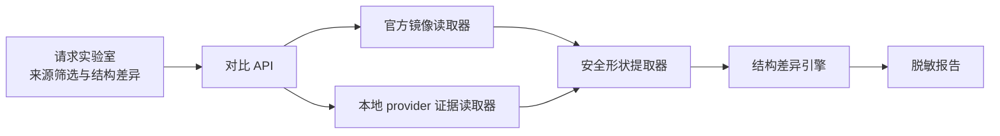

# Design: request-comparison-lab

## Architecture



实验室只在用户选择的两个来源之间生成结构差异。它不把 `official.raw.jsonl` 变成通用原文浏览器，也不自动把时间相近的官方请求和本地请求宣称为同一会话。

## Interfaces

- `ProxyService.ListRequestSources(query RequestSourceQuery)`
  - Input: `kind`、模型、状态、时间范围、分页；`kind` 仅允许 `official_mirror`、`local_provider`。
  - Output: `RequestSourcePage`。
  - Error codes: `request_source_unavailable`、`request_source_read_failed`、`request_source_query_invalid`。
  - Invariants: 不返回正文、URL query、headers、工具 schema 值、完整请求 ID 或文件路径。

- `ProxyService.BuildRequestComparison(request RequestComparisonRequest)`
  - Input: 用户明确选择的左右来源引用。
  - Output: `RequestComparison`。
  - Error codes: `request_source_not_found`、`request_source_truncated`、`request_comparison_unsupported`、`request_comparison_parse_failed`。
  - Invariants: 推荐配对只返回置信等级和原因；最终比较必须由用户选择。

- `ProxyService.ExportSanitizedRequestComparison(comparisonID string)`
  - Output: `{ path: string, sha256: string }`。
  - Error codes: `comparison_not_found`、`comparison_export_failed`。
  - Invariants: 报告不包含 prompt、回复、API Key、Cookie、完整 URL、文件路径或工具参数值。

```go
type RequestSourceRef struct {
    Kind string `json:"kind"`
    ID   string `json:"id"`
}

type RequestSourceQuery struct {
    Kind       string `json:"kind"`
    Model      string `json:"model,omitempty"`
    Status     string `json:"status,omitempty"`
    FromUnixMS int64  `json:"fromUnixMs,omitempty"`
    ToUnixMS   int64  `json:"toUnixMs,omitempty"`
    Limit      int    `json:"limit"`
    Cursor     string `json:"cursor,omitempty"`
}

type RequestSourceSummary struct {
    Ref             RequestSourceRef `json:"ref"`
    TimestampUnixMS int64            `json:"timestampUnixMs"`
    Model           string           `json:"model,omitempty"`
    Provider        string           `json:"provider,omitempty"`
    Protocol        string           `json:"protocol,omitempty"`
    Status          string           `json:"status,omitempty"`
    ShapeAvailable  bool             `json:"shapeAvailable"`
    Truncated       bool             `json:"truncated,omitempty"`
}

type RequestSourcePage struct {
    Items      []RequestSourceSummary `json:"items"`
    NextCursor string                 `json:"nextCursor,omitempty"`
}

type RequestComparisonRequest struct {
    Left  RequestSourceRef `json:"left"`
    Right RequestSourceRef `json:"right"`
}

type RequestFieldDiff struct {
    Path         string `json:"path"`
    Kind         string `json:"kind"`
    LeftType     string `json:"leftType,omitempty"`
    RightType    string `json:"rightType,omitempty"`
    LeftSummary  string `json:"leftSummary,omitempty"`
    RightSummary string `json:"rightSummary,omitempty"`
    Sensitive    bool   `json:"sensitive,omitempty"`
}

type RequestComparisonSection struct {
    Name  string             `json:"name"`
    Diffs []RequestFieldDiff `json:"diffs"`
}

type RequestComparison struct {
    ID           string                     `json:"id"`
    Left         RequestSourceSummary       `json:"left"`
    Right        RequestSourceSummary       `json:"right"`
    MatchLevel   string                     `json:"matchLevel"`
    MatchReasons []string                   `json:"matchReasons,omitempty"`
    Sections     []RequestComparisonSection `json:"sections"`
}
```

`Limit` 允许 1 到 200，默认 50；游标是不透明字符串，客户端不得自行拼接。`MatchLevel` 仅允许 `none`、`weak`、`probable`、`explicit`，其中只有用户选择的来源可以形成 `explicit`。

差异路径只允许协议字段路径，如 `/messages/roles`、`/tools/count`、`/thinking/enabled`、`/cache_control/present`。字符串默认输出存在性、类型、长度区间或不可逆摘要。

## Data Model

- 官方来源继续以 `official.raw.jsonl` 为原始证据，后端按需读取并生成短生命周期形状摘要。
- 本地来源复用 `provider.jsonl`、`runtime.jsonl`、`usage.json` 和请求指标，不建立第二份原始正文存储。
- `RequestComparison` 只在进程内缓存；导出为版本化的无正文 JSON/Markdown 报告。
- 无法确认敏感性的字符串一律按敏感处理。

## Key Decisions

- Problem: 原始请求最适合协议调试，但直接在应用内展示会扩大提示词、回复、密钥型查询参数和工具参数的暴露面。
  Solution: 后端解析原始证据，只输出结构路径、类型、计数、存在性、长度区间和摘要。
  Cost: 用户不能在应用内逐字查看请求正文，需要继续使用本地受控工具做深度分析。
  Why not the alternatives: 原文浏览违反既有抓包边界；完全不做对比则抓包只能靠手工检索；自动按时间配对会在并发请求下产生错误结论。

## Migration / Compatibility

- 不修改镜像默认关闭、记录路径、脱敏、截断和官方直通语义。
- 旧抓包缺少结构字段时显示 `shapeAvailable=false`，不猜测。
- 现有协议历史页继续只读安全时间线；请求实验室是独立标签，不替换历史页。
